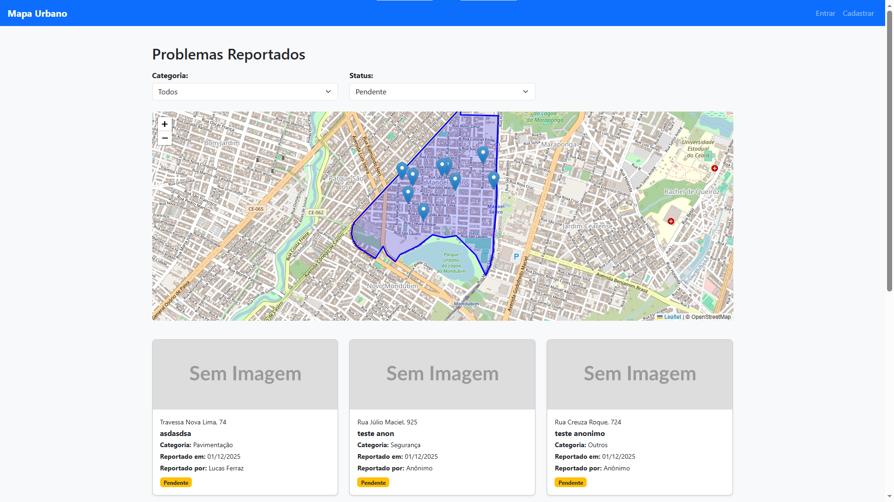
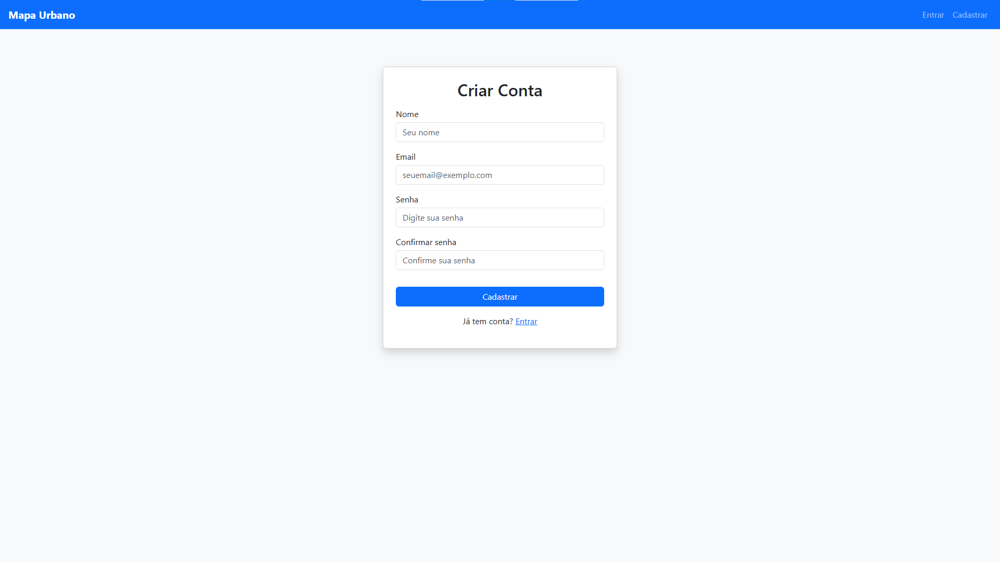
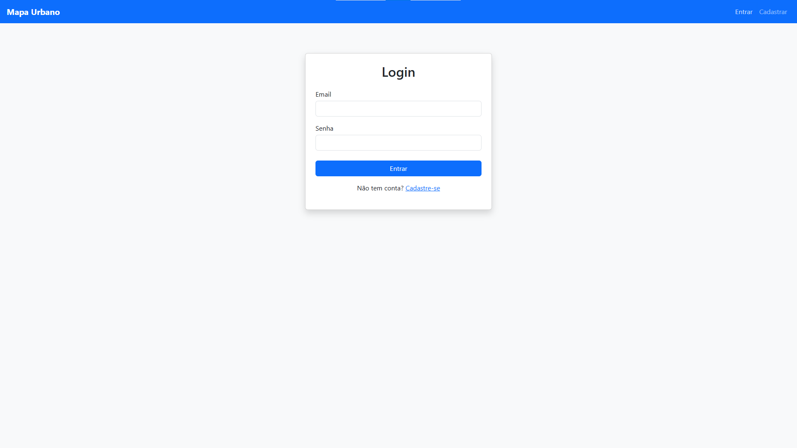
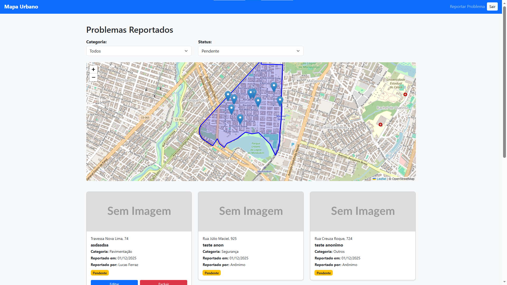
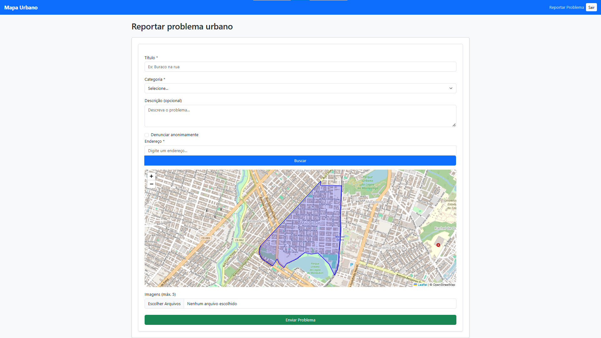
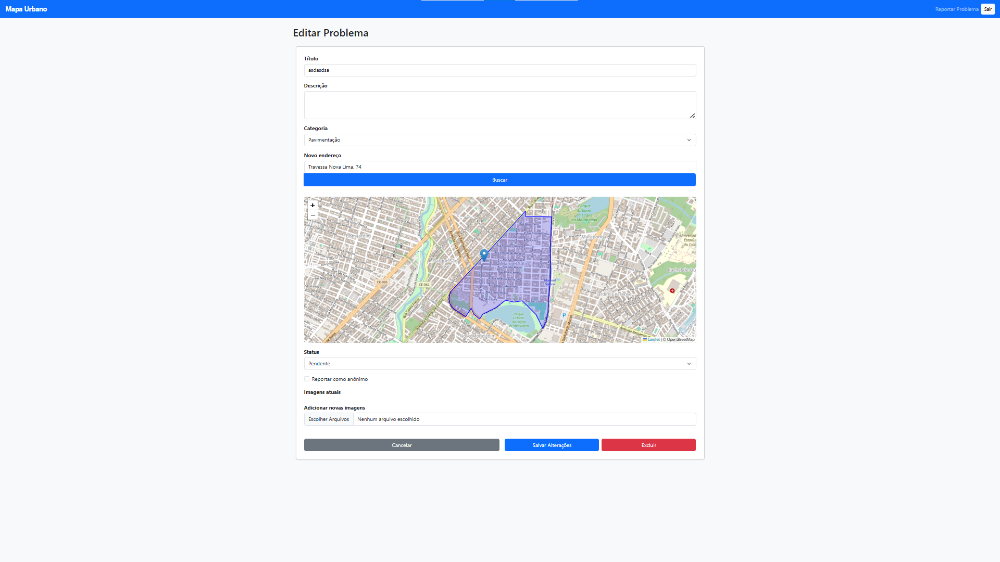

# PROJETO PARA A DISCIPLINA  *N708 - Projeto Aplicado Multiplataforma - Etapa 2*  DO CURSO DE ADS NA UNIFOR
---

## 1. Título e descrição do projeto

### - Nome do sistema:
Mapa de Problemas Urbanos — Vila Manoel Sátiro / Fortaleza-CE

### - Breve descrição do propósito:

Uma aplicação web simples e funcional para mapear **problemas urbanos** reportados pelos moradores, como buracos, iluminação precária, lixo acumulado, esgoto a céu aberto, alagamentos, entre outros. 

O objetivo é permitir que cidadãos, associações de moradores e poder público tenham uma visão clara dos pontos críticos do bairro, facilitando denúncias e a cobrança por soluções.

### - Problema solucionado:

Bairros periféricos de Fortaleza, como Vila Manoel Sátiro, enfrentam problemas recorrentes relacionados à infraestrutura urbana, com pouca visibilidade e dificuldade para registrar e acompanhar denúncias. 

Atualmente, muitas reclamações se perdem em redes sociais, grupos de WhatsApp e ligações para órgãos públicos sem rastreamento.

Este projeto cria um **mapa colaborativo**, permitindo visualizar exatamente **onde** estão os problemas, **quando** foram reportados e **quem** reportou (com opção de anonimato). 

Desta forma a iniciativa apoia diretamente os objetivos da **ODS 11 (Cidades e Comunidades Sustentáveis)**.

## 2. Funcionalidades implementadas

### - Lista de funcionalidades principais:

- Permitir que usuários reportem problemas urbanos com localização geográfica.
- Criar um mapa interativo exibindo todos os problemas registrados.
- Permitir reportar de forma identificada ou anônima.
- Facilitar a visualização de categorias de problemas através de filtros.
- Criar histórico de status do problema (pendente, em andamento, resolvido).

### - Status de implementação (completo, parcial):

Funcionalidades principais previstas implementadas.

### - Screenshots das telas principais:

- Página inicial


- Cadastro de usuário


- Login de usuário


- Página inicial com usuário logado:


- Reportar problema:


- Editar problema:


## 3. Tecnologias utilizadas

### - Linguagens de programação / Frameworks e bibliotecas:

#### Frontend

- Next.js 14 (React)
- TypeScript
- Bootstrap
- Leaflet
- Axios

#### Backend

- Node.js
- Express.js
- TypeScript
- JWT
- Multer
- Mongoose
### - Banco de dados:

- MongoDB

### - Ferramentas de desenvolvimento:

- IDE: Visual Studio Code
- Obsidian (docs em markdown)

## 4. Arquitetura do sistema

### - Visão geral da arquitetura implementada:

A aplicação segue uma arquitetura **cliente-servidor**, separando claramente:

- **Frontend (Next.js)** — camada de apresentação e interação com usuário. 
- **Backend (Node.js + Express)** — serviços REST, autenticação, regras de negócio. 
- **Banco (MongoDB)** — armazenamento dos problemas e usuários.

O sistema utiliza autenticação JWT e se comunica exclusivamente via requisições HTTP REST.

### - Componentes principais:

- AddressSearch: para consulta e normalização dos endereços registrados;
- ProblemMap: para controlar a exibição dos mapas;
- LocationPickerMap: para controlar a colocação de pins no mapa;
- Navbar: para controlar a exibição da navbar de acordo com o estado do sistema;
- ProblemForm: para organizar o formulário de reportação de problemas;
- ProblemCard: para organizar as informações exibidas nos cards dos problemas reportados.

### - Integrações realizadas:

- Integração frontend <-> backend,
- Banco de dados com MongoDB,
- Upload de imagens com Multer + Cloudinary,
- Autenticação com JWT,
- Deploy com Vercel + Render,
- e bibliotecas auxiliares.

## 5. Instruções de instalação e execução

### - Pré-requisitos:

Antes de iniciar, certifique-se de ter instalado:
#### Ambiente

- **Node.js** — versão **18+**
- **npm** ou **yarn**
- **Git**
- **MongoDB Atlas** (ou MongoDB local)
- Conta no **Cloudinary** (para upload de imagens)
  
#### Ferramentas recomendadas

- VSCode (com extensão REST Client ou Thunder Client/Postman)
- Terminal integrado (PowerShell, CMD, Git Bash)

### - Passo a passo para instalação:

#### Backend

- Clonar repositório
```
git clone https://github.com/rxaxax/n708-mapa-de-problemas-urbanos-vms.git
```

- Acessar pasta do backend
```
cd backend
```

- Instalar dependências
```
npm install
```

- Criar arquivo de variáveis de ambiente

Dentro da pasta **backend**, crie o arquivo `.env` com o seguinte conteúdo:

```
PORT=5000  
MONGO_URI=<sua_connection_string_do_mongodb>  
JWT_SECRET=<sua_chave_secret>  
CLOUDINARY_CLOUD_NAME=<cloud_name> 
CLOUDINARY_API_KEY=<api_key> 
CLOUDINARY_API_SECRET=<api_secret>
```
Obs.: troque tudo que está entre <> por valores reais.

#### Frontend

- Acessar pasta do frontend
A partir da raiz do projeto: `cd frontend/web`

- Instalar dependências
```
npm install
```
- Criar arquivo de variáveis de ambiente
Dentro da pasta **frontend/web**, crie o arquivo `.env.local` com o seguinte conteúdo:

```
NEXT_PUBLIC_API_URL=http://localhost:5000
```

### - Comandos para execução:


- Executar o Backend

Na raiz do diretório **backend**:  `npm run dev`

- Executar o Frontend

Em **frontend/web**: `npm run dev`

### - Configurações necessárias:

Sem configurações adicionais.

## 6. Acesso ao sistema

### - URL de acesso (se hospedado):
[n708-mapa-de-problemas-urbanos-vms.vercel.app](https://n708-mapa-de-problemas-urbanos-vms.vercel.app/)

### - Credenciais de teste:
Não se aplica

## 7. Validação com Público-Alvo

### - Definição específica do público-alvo:

Inicialmente o projeto tinha como público-alvo a população do bairro Vila Manoel Sátiro em geral, associação de moradores, líderes comunitários e políticos engajados com o bairro. Vimos, no entanto, que a possibilidade de público para a solução proposta era elástica, podendo incluir tantas outras categorias (considerando a ampliação da proposta para outros bairros, regionais etc.). Assim, para a validação neste momento, apresentamos o projeto para Gabriela Dourado, comunicóloga, trabalhadora da Arte e Cultura, e ex-moradora do bairro em questão.


### - Resumo do processo de validação:

O processo de validação se deu pela apresentação do projeto para um integrante do público-alvo via videochamada. Apresentamos o problema que motivou a conceituação do projeto de software, assim como a proposta de solução e por fim o MVC desenvolvido na disciplina de Projeto Aplicado Multiplataforma - Etapa 2 (N708). Pudemos colher feedbacks durante a apresentação, bem como posteriormente a partir de um formulário online (Google Forms), que foi enviado para o usuário após o mesmo ter acesso ao sistema hospedado na web.

### - Principais feedbacks recebidos:

Na maior parte os feedbacks recebidos se referiram a experiência de usuário (UX). Melhorias na navegabilidade e interface gráfica foram os principais comentários colhidos. Além de sugestões sobre possíveis futuras funcionalidades para o sistema, como:

- Implementação de sistema de mensagens
- Implementação de informações para reportar os problemas por meios formais

### - Ajustes implementados:

Até a publicação da atividade os ajustes só foram documentados para posterior implementação conforme viabilidade.

## 8. Equipe de desenvolvimento

### - Membros da equipe/Papéis e contribuições principais:

Todas as funções no desenvolvimento, da documentação ao deploy, feitos por Renato Alexandre Alves (Mat. 2318140).
